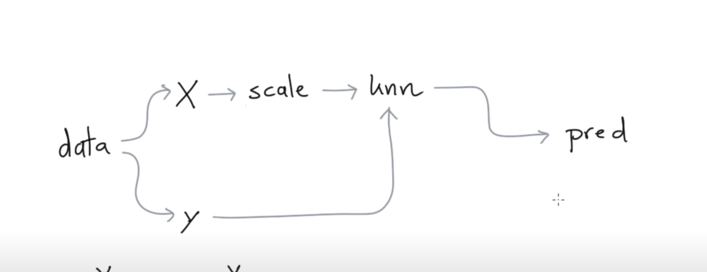

# 1 Intro Scikit-learn
1. [Importar librerías y cargar los datos ](#schema1)

# 1. Importar librerías y cargar los datos

~~~python

from sklearn.datasets import load_boston
from sklearn.neighbors import KNeighborsRegressor

import matplotlib.pylab as plt

X, y = load_boston(return_X_y=True)
~~~

# 2. KNeighborsRegressor()

~~~python
mod = KNeighborsRegressor()
mod.fit(X, y)
mod.predict(X)[:3]
array([21.78, 22.9 , 25.36])
~~~

~~~python
mod = KNeighborsRegressor().fit(X, y)
pred = mod.predict(X)
plt.scatter(pred, y)
~~~

# 3. Preprocesamiento

### Estandarizar los datos `StandardScaler`

~~~python
from sklearn.pipeline import Pipeline
from sklearn.preprocessing import StandardScaler
mod = KNeighborsRegressor().fit(X, y)

pipe = Pipeline([
    ("scale", StandardScaler()),
    ("model", KNeighborsRegressor())
])
pred = pipe.fit(X, y).predict(X)
plt.scatter(pred, y)
~~~

### Usando `GridSearchCV`, tuneando los valores

~~~python
from sklearn.model_selection import GridSearchCV
import pandas as pd
mod = GridSearchCV(estimator=pipe,
                 param_grid={
                   'model__n_neighbors': [1, 2, 3, 4, 5, 6, 7, 8, 9, 10]
                 },
                 cv=3)
mod.fit(X, y)
pd.DataFrame(mod.cv_results_)
~~~
